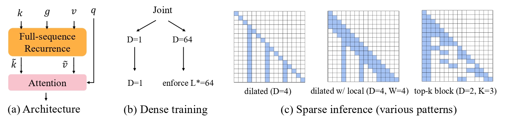
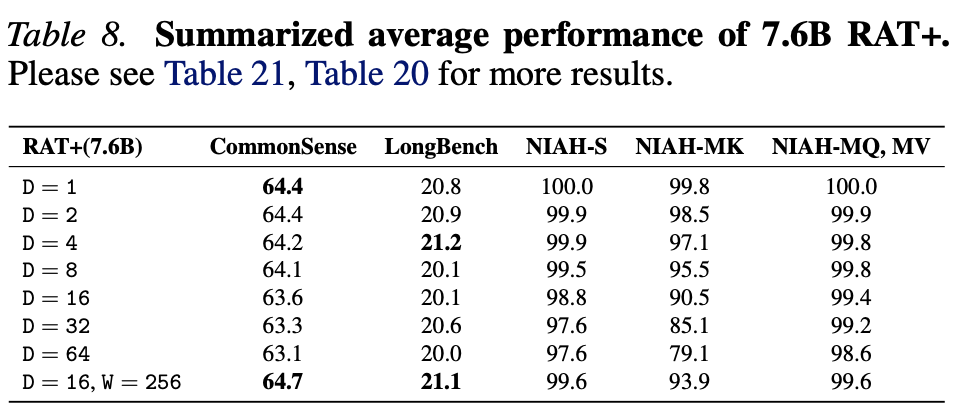

# RAT+: Train Dense, Infer Sparse - Recurrence Augmented Attention for Dilated Inference

[](https://arxiv.org/abs//2602.18196)
[](https://huggingface.co/barpitf/ratplus)


By Xiuying Wei and Caglar Gulcehre. 

Official implementation of **RAT+**, a dense-pretraining architecture that augments attention with full-sequence recurrence and active recurrence learning to enable more flexible inference.

A single RAT+ model is pretrained densely once and can then be flexibly switched at inference time to dilated attention (optionally with local windows) or hybrid layer/head compositions, requiring only a short 1B-token resolution adaptation rather than retraining separate sparse models. We validate our method at 1B, 3B, and 7B model scale. RAT+ also provides better performance on top-k block pattern compared to standard attention.

Note that this flexibility is not achieved by exposing the model to various configurations during training, which may lead to insufficient optimization of each configuration. Instead, it comes from modifying the architecture to achieve accurate and stable performance across different settings. Specifically, the model contains both a fast recurrence mechanism and an accurate attention mechanism, both of which are well optimized during training. At inference time, we can then decide, in a hierarchical manner, how much to rely on fast recurrence and how much to rely on attention to have different trade-offs between efficiency and accuracy.
<p align="center">
  
</p>
<p align="center">
  
</p>

## Table of Contents

- [Position of RAT+](#position-of-rat)
- [Checkpoints](#checkpoints)
- [Reproduce](#code)
  - [File Organization](#file-organization)
  - [Environment](#environment)
  - [Pretraining and Validation Loss](#pretraining-and-validation-loss)
  - [Adaptation with 1B Tokens](#adaptation-with-1b-tokens)
  - [Downstream Results on three benchmarks](#downstream-results)
  - [Efficiency Results](#efficiency-results)
- [Citation](#citation)

## Position of RAT+

RAT+ bridges the pretraining architecture and flexible inference. The table below positions RAT+ among existing efficiency methods, considering temporal-mixing prefilling FLOPs reduction, decoding FLOPs reduction, KV cache reduction, and direct long-range access. We define direct long-range access as the ability to explicitly attend to distant tokens. SSM and StreamingLLM, which operate at similar efficiency levels, are compared in Subsec. 5.2. Further comparisons are provided in Subsec. 5.3. Top-k block methods include Quest and MoBA.

| Method | Prefill FLOPs | Decode FLOPs| KV cache reduction | Long-range access | Comparison |
|---|---|---|---|---|---|
| RAT+ | ✓ | ✓ | ✓ | ✓ | |
| Pretraining architecture |  |  |  |  |  |
| SSM | ✓ | ✓ | ✓ | ✗ | Table 4 and Table 5 |
| GQA | ✗ | ✗ | ✓ | ✓ | Figure 5 |
| Inference-time sparsity |  |  |  |  |  |
| StreamingLLM | ✓ | ✓ | ✓ | ✗ | Table 4 and Table 5 |
| Top-k block | ✓ | ✓ | ✗ | ✓ | Table 7, 16, 17, 18 |
| SnapKV | ✗ | ✓ | ✓ | ✓ | Table 7 |

## Checkpoints

We release our checkpoints and pretraining data at https://huggingface.co/barpitf/ratplus, which contains 1B (100BT), 7B (100BT), and 3B (200BT) models. Note that the models under the pretrain/ directory should not be used directly for evaluation. These models need to undergo the resolution adaptation phase with the corresponding inference dilation size, local size, and initial size. Since there can be various configurations, we provide only one example, D=16 and W=256, under the adapt/ directory. For other configurations, we leave the adaptation to the readers. This process is fast and stable: 1B tokens are sufficient for all pretrained models; we used a simple optimization scheme and found it to work well, and we observed that other optimization hyperparameters also work well.

**Finally, this should reproduce the results shown in Figure 6.**

## Code

### File Organization
```
├── configs/
│   ├── config.yaml
│   ├── data/
│   ├── experiment/      # Entry point for launching experiments
│   ├── model/
│   ├── optim/
│   └── task/
├── src/
│   ├── benchmark_acc/   # Entry point for accuracy benchmarking
│   ├── benchmark_eff/   # Entry point for efficiency benchmarking
│   ├── data/
│   ├── model/
│   │   ├── backbone/    # Sequence-model backbones and layers
│   │   ├── embedding/   # Language-model embeddings and positional embeddings
│   │   └── head/        # Language-model heads
│   ├── optim/           # Learning-rate schedulers and optimizers
│   ├── task/            # Assembles backbone, embeddings, and heads; defines metrics and losses
│   ├── trainer/
│   │   ├── fsdp_trainer/ # FSDP trainer
│   │   └── trainer/      # DDP trainer
│   └── utils/
```

### Environment

We provide the environment in the Dockerfile.

### Pretraining and Validation Loss

* Prepare the training data:

    ```python
    # Downloading
    from datasets import load_dataset
    ds = load_dataset("HuggingFaceFW/fineweb-edu", "sample-100BT")
    ```

    ```bash
    # Tokenize the data with the LLaMA2 tokenizer
    cd tokenize && python fineweb_edu.py --tokenizer llama --num_proc 32
    ```

* Attention baselines with output gating:

    ```bash
    # Standard attention
    torchrun --nnodes=16 --nproc_per_node=4 lm.py experiment=fineweb_edu/attention-1b model.backbone.seq_cell.dilation_size=1 model.backbone.seq_cell.local_size=0 model.backbone.seq_cell.apply_re=false model.backbone.seq_cell.joint_train=false

    # Also coupled with joint training to match training FLOPs. There are two options:
    # (D=1 | D=64) or (D=1 | W=64), given T=4096.
    torchrun --nnodes=16 --nproc_per_node=4 lm.py experiment=fineweb_edu/attention-1b model.backbone.seq_cell.dilation_size=64 model.backbone.seq_cell.local_size=0 model.backbone.seq_cell.apply_re=false model.backbone.seq_cell.joint_train=true
    torchrun --nnodes=16 --nproc_per_node=4 lm.py experiment=fineweb_edu/attention-1b model.backbone.seq_cell.dilation_size=-1 model.backbone.backbone.seq_cell.local_size=64 model.backbone.seq_cell.apply_re=false model.backbone.seq_cell.joint_train=true
    ```

* RAT+ results with additional recurrence:

    ```bash
    # 1B
    torchrun --nnodes=16 --nproc_per_node=4 lm.py experiment=fineweb_edu/ratplus-1b model.backbone.seq_cell.apply_re=true model.backbone.seq_cell.joint_train=true

    # 3B, 200B tokens
    torchrun --nnodes=16 --nproc_per_node=4 lm.py experiment=fineweb_edu/ratplus-3b-200bt model.backbone.seq_cell.apply_re=true model.backbone.seq_cell.joint_train=true

    # 7B, 100B tokens. We use the FSDP trainer.
    torchrun --nnodes=16 --nproc_per_node=4 lm.py experiment=fineweb_edu/ratplus-7b model.backbone.seq_cell.apply_re=true model.backbone.seq_cell.joint_train=true
    ```

### Adaptation with 1B Tokens

Note that this process is brought by the attention mechanism itself, as analyzed in Sec. 3.1. However, 1B tokens are sufficient for all cases, as shown in Figure 8. To enable adaptation, we turn off joint training and specify the desired dilation size, local size, and initial size. An example is shown below. For other configurations, please check the adaptation config directory.

```bash
# Adapt D=16, W=256
torchrun --nnodes=4 --nproc_per_node=4 lm.py experiment=fineweb_adapt/1b/ratplus-1b model.backbone.seq_cell.apply_re=true model.backbone.seq_cell.joint_train=false model.backbone.seq_cell.dilation_size=16 model.backbone.seq_cell.local_size=256 model.backbone.seq_cell.initial_size=4 trainer.pretrained_path="[Your pretrained ckpt]"
```

### Downstream Results

After we obtain the adapted models, we can conduct different downstream evaluations with them.

* CommonSense reasoning: We evaluate it using the [lm-evaluation-harness](https://github.com/EleutherAI/lm-evaluation-harness) repo. We provide the necessary files in `eval/lm_harness`.

  - Download the lm-evaluation-harness repo. Put our files in `eval/lm_harness` under its `lm_eval/models/`.
  - Run the command:

    ```bash
     # Eval 1B RAT+ with D=16, W=256
    command="experiment=fineweb_adapt/1b/ratplus-1b,wandb_use=false,trainer.pretrained_path=[Your adapted model path],model.backbone.seq_cell.apply_re=true,model.backbone.seq_cell.joint_train=false,model.backbone.seq_cell.dilation_size=16,model.backbone.seq_cell.local_size=256,model.backbone.seq_cell.initial_size=4"
    export task=piqa,arc_easy,arc_challenge,winogrande,lambada_openai,hellaswag
    lm_eval --model sequence_llm --model_args pretrained=attention,dtype=float32 --tasks ${task} --device cuda:0 --batch_size 16 --trust_remote_code --hydra_overrides ${command}
    ```

* LongBench: We evaluate it using the [LongBenchV1](https://github.com/THUDM/LongBench) repo.

  - Download LongBench and replace its files with the three corresponding ones under our `eval/longbench`.
  - Generate:

    ```bash
      # Eval 1B RAT+ with D=16, W=256
    python pred.py --hydra_overrides="experiment=gen/longbench/basic-1b;wandb_use=false;model.backbone.seq_cell.dilation_size=16;model.backbone.seq_cell.local_size=256;model.backbone.seq_cell.initial_size=4;trainer.pretrained_path=[Your adapted model path with the corresponding sparse configuration]" --data_type 2
    ```

  - Evaluate the results:

    ```bash
    python eval.py [result path]
    ```

* NVIDIA/RULER 8 NIAH tasks: As it is hard for pretrained-only models to deal with heavy prompt-style datasets, and to evaluate the true retrieval ability of the mechanism itself, we do a separate SFT on the train split to learn the prompt before evaluation.

  - Download the [NVIDIA/RULER benchmark](https://github.com/NVIDIA/RULER) to prepare the dataset, then follow `tokenize/needle.py` to preprocess the dataset.
  - SFT:

    ```bash
     # SFT 7B RAT+ with D=16, W=256
    torchrun --nnodes=4 --nproc_per_node=4 lm.py experiment=ruler_sft/basic-7b model.backbone.seq_cell.apply_re=true model.backbone.seq_cell.joint_train=false model.backbone.seq_cell.dilation_size=16 model.backbone.seq_cell.local_size=256 model.backbone.seq_cell.initial_size=4 trainer.max_epoch=4 trainer.pretrained_path="[Your adapted model path]"
    ```

  - Generation:

    ```bash
    export tasks="niah_single_1 niah_single_2 niah_single_3 niah_multikey_1 niah_multikey_2 niah_multikey_3 niah_multivalue niah_multiquery"
    for t in ${tasks}; 
    do 
      torchrun --nnodes=1 --nproc_per_node=4 generation.py experiment=gen/ruler/basic-7b wandb_use=false model.backbone.seq_cell.apply_re=true model.backbone.seq_cell.joint_train=false  model.backbone.seq_cell.dilation_size=16 model.backbone.seq_cell.local_size=256 model.backbone.seq_cell.initial_size=4 trainer.pretrained_path="[Your sft model path]" data._name_=${t}
    done
    ```

  - Evaluate the results:

    ```bash
    cd eval/ruler
    python ruler_eval.py [your results path]
    ```

### Efficiency Results

We test latency on the GH200 GPU.

* Single layer, including the input and output projections, and single core:

    ```bash
    cd src/benchmark_eff
    python rat_eff.py
    python ratcore_eff.py
    ```

* Maximum throughput of full models:

    ```bash
    cd src/benchmark_eff
    # We run it twice. The first time is used to find the maximum batch size we can set.
    # The second time is used to test the latency.
    torchrun --nnodes=1 --nproc_per_node=1 model_eff.py experiment=fineweb_edu/ratplus-1b
    ```

## Citation

If you find this work useful, please cite:

The repository structure is built upon https://github.com/CLAIRE-Labo/RAT.

```bibtex
@article{wei2025rat,
  title={RAT: Bridging RNN Efficiency and Attention Accuracy via Chunk-based Sequence Modeling},
  author={Wei, Xiuying and Yadav, Anunay and Pascanu, Razvan and Gulcehre, Caglar},
  journal={arXiv preprint arXiv:2507.04416},
  year={2025}
}

@article{wei2026ratplus,
  title={RAT+: Train Dense, Infer Sparse--Recurrence Augmented Attention for Dilated Inference},
  author={Wei, Xiuying and Gulcehre, Caglar},
  journal={arXiv preprint arXiv:2602.18196},
  year={2026}
}
```
